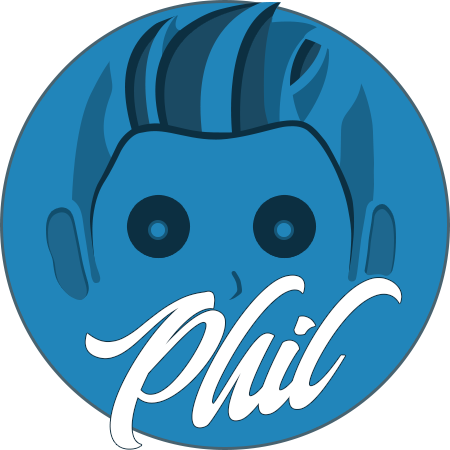

# Hi there!!!

My name is Philippe and I am currently studying web programming on my own. My goal is to improve my weaknesses using the resources available nowadays, focusing on using less code to achieve results without having to get tangled up along the way. I really like the diversity that exists especially when we talk about web APIs.

##

### I'm most used to ↓</h3>

    

### I’m currently learning ↓

    

### 🔭 I’m currently working on <a href="https://srphilippe.github.io/phil-portfolio/">my personal webpage</a>

---

