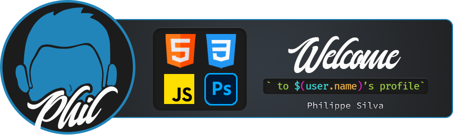

I'm Philippe, a student from Brazil. I study web programming on my own. My goal is to improve my knowledge and skills using the resources available nowadays, focusing on using fewer blocks of code to achieve the same results as before. In this world of web development, I think it's amazing what we have today when we talk about web APIs.

<h4>I'm currently learning</h4>

🔭 I’m currently working on <a href="https://srphilippe.github.io/phil-portfolio/">my personal webpage</a>

